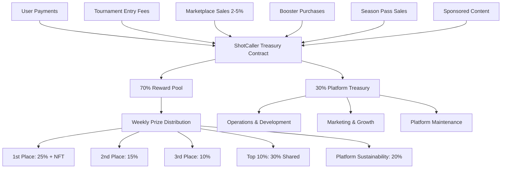
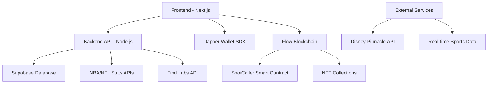

# Design Document

## Overview

ShotCaller is a Next.js-based fantasy sports application that integrates with Flow blockchain and Dapper Wallet to create a gamified experience for NFT collectors. The system transforms static NBA Top Shot and NFL All Day Moments into functional gaming assets through weekly fantasy competitions with real-world player performance tracking.

## Architecture

### Revenue Model Architecture



### High-Level Architecture



### Frontend Architecture

- **Framework**: Next.js 15 with App Router
- **Styling**: TailwindCSS with shadcn/ui components
- **State Management**: React Context + Zustand for complex state
- **Charts**: Recharts for data visualization
- **Authentication**: Dapper Wallet SDK integration

### Backend Architecture

- **Runtime**: Node.js with Express.js
- **Database**: Supabase (PostgreSQL)
- **Caching**: Redis for API response caching
- **Queue System**: Bull Queue for background jobs
- **API Integration**: Axios with retry logic

### Blockchain Architecture

- **Network**: Flow Testnet (development) / Mainnet (production)
- **Smart Contracts**: Cadence language
- **Wallet Integration**: Dapper Wallet SDK
- **NFT Verification**: Flow Access API + Find Labs API

## Components and Interfaces

### Frontend Components

#### Core Pages
- **Home Page** (`/`): Landing page with game overview, wallet connection, and tournament highlights
- **Team Builder** (`/team`): NFT selection, lineup management, and booster activation
- **Leaderboard** (`/leaderboard`): Rankings, competitive standings, and prize pools
- **Results** (`/results`): Performance analytics, scoring details, and reward history
- **Profile** (`/profile`): User stats, NFT collection, reward history, and premium status
- **Marketplace** (`/marketplace`): NFT trading, listings, and purchase interface
- **Treasury** (`/treasury`): Tournament entry, booster shop, and season pass purchase
- **Premium** (`/premium`): Advanced analytics, extra features, and subscription management

#### Shared Components
- **WalletConnector**: Dapper Wallet integration component with FLOW balance display
- **NFTCard**: Reusable NFT display with metadata and marketplace pricing
- **PlayerStats**: Real-time player performance display
- **ScoreChart**: Recharts-based scoring visualization
- **LeaderboardTable**: Sortable rankings display with prize information
- **RewardDisplay**: Prize and token reward interface with distribution percentages
- **PaymentModal**: FLOW token payment interface for tournaments and purchases
- **MarketplaceCard**: NFT listing display with buy/sell functionality
- **BoosterInventory**: Power-up and booster management interface
- **TreasuryDashboard**: Admin interface for treasury and fee management
- **PremiumBadge**: Premium access indicator and upgrade prompts

#### Layout Components
- **Navigation**: Main site navigation with wallet status
- **Sidebar**: Quick access to key features
- **Footer**: Links and game information

### Backend API Endpoints

#### Authentication Endpoints
```typescript
POST /api/auth/connect
POST /api/auth/verify
POST /api/auth/disconnect
```

#### NFT Management
```typescript
GET /api/nfts/owned/:address
GET /api/nfts/metadata/:id
POST /api/nfts/verify-ownership
```

#### Game Management
```typescript
POST /api/lineups/submit
GET /api/lineups/current/:address
PUT /api/lineups/update/:id
GET /api/contests/current
POST /api/tournaments/create
POST /api/tournaments/join
GET /api/tournaments/available
```

#### Treasury and Payments
```typescript
POST /api/payments/tournament-entry
POST /api/payments/booster-purchase
POST /api/payments/season-pass
GET /api/treasury/status
POST /api/treasury/distribute-rewards
```

#### Marketplace
```typescript
GET /api/marketplace/listings
POST /api/marketplace/list-nft
POST /api/marketplace/purchase
DELETE /api/marketplace/cancel/:listingId
GET /api/marketplace/my-listings/:address
```

#### Boosters and Power-ups
```typescript
GET /api/boosters/available
POST /api/boosters/purchase
POST /api/boosters/activate
GET /api/boosters/inventory/:address
GET /api/disney-pinnacle/owned/:address
```

#### Premium Features
```typescript
POST /api/premium/purchase-season-pass
GET /api/premium/status/:address
GET /api/premium/analytics/:address
GET /api/premium/advanced-stats
```

#### Statistics and Scoring
```typescript
GET /api/stats/player/:id
GET /api/scores/weekly/:week
GET /api/scores/season/:address
POST /api/scores/calculate
```

#### Leaderboards and Rewards
```typescript
GET /api/leaderboard/weekly
GET /api/leaderboard/season
GET /api/rewards/history/:address
POST /api/rewards/distribute
```

### Smart Contract Interfaces

#### ShotCaller Treasury Contract
```cadence
pub contract ShotCaller {
    // Treasury management
    pub var treasuryVault: @FlowToken.Vault
    pub var rewardPoolVault: @FlowToken.Vault
    access(self) var weeklyWinners: {UInt64: {Address: UFix64}}
    
    // Fee collection and routing
    pub fun collectFee(from: @FlowToken.Vault, amount: UFix64): @FlowToken.Vault
    pub fun withdrawTreasury(amount: UFix64): @FlowToken.Vault
    
    // NFT ownership verification
    pub fun verifyOwnership(address: Address, momentID: UInt64): Bool
    
    // Tournament and contest management
    pub fun createTournament(weekID: UInt64, entryFee: UFix64, maxParticipants: UInt64)
    pub fun joinTournament(address: Address, weekID: UInt64, payment: @FlowToken.Vault)
    pub fun submitLineup(address: Address, lineup: [UInt64])
    pub fun getLineup(address: Address): [UInt64]?
    
    // Reward distribution with structured percentages
    pub fun distributeRewards(weekID: UInt64, winners: {Address: UFix64})
    pub fun claimReward(address: Address, weekID: UInt64)
    
    // Marketplace functionality
    pub fun listNFTForSale(seller: Address, momentID: UInt64, price: UFix64)
    pub fun purchaseNFT(buyer: Address, momentID: UInt64, payment: @FlowToken.Vault)
    pub fun cancelListing(seller: Address, momentID: UInt64)
    
    // Booster and power-up management
    pub fun purchaseBooster(buyer: Address, boosterType: String, payment: @FlowToken.Vault)
    pub fun activateBooster(address: Address, boosterID: UInt64, lineupID: UInt64)
    
    // Premium access management
    pub fun purchaseSeasonPass(buyer: Address, payment: @FlowToken.Vault)
    pub fun verifyPremiumAccess(address: Address): Bool
}
```

## Data Models

### Database Schema

#### Users Table
```sql
CREATE TABLE users (
    id UUID PRIMARY KEY DEFAULT gen_random_uuid(),
    wallet_address VARCHAR(42) UNIQUE NOT NULL,
    username VARCHAR(50),
    created_at TIMESTAMP DEFAULT NOW(),
    last_login TIMESTAMP,
    total_points INTEGER DEFAULT 0,
    season_rank INTEGER,
    wins INTEGER DEFAULT 0,
    losses INTEGER DEFAULT 0
);
```

#### NFTs Table
```sql
CREATE TABLE nfts (
    id UUID PRIMARY KEY DEFAULT gen_random_uuid(),
    moment_id BIGINT UNIQUE NOT NULL,
    player_name VARCHAR(100) NOT NULL,
    team VARCHAR(50),
    position VARCHAR(10),
    sport VARCHAR(10) NOT NULL,
    rarity VARCHAR(20),
    metadata JSONB,
    last_updated TIMESTAMP DEFAULT NOW()
);
```

#### Lineups Table
```sql
CREATE TABLE lineups (
    id UUID PRIMARY KEY DEFAULT gen_random_uuid(),
    user_id UUID REFERENCES users(id),
    week_id INTEGER NOT NULL,
    nft_ids BIGINT[] NOT NULL,
    total_points INTEGER DEFAULT 0,
    submitted_at TIMESTAMP DEFAULT NOW(),
    locked BOOLEAN DEFAULT FALSE
);
```

#### Contests Table
```sql
CREATE TABLE contests (
    id UUID PRIMARY KEY DEFAULT gen_random_uuid(),
    week_id INTEGER UNIQUE NOT NULL,
    start_time TIMESTAMP NOT NULL,
    end_time TIMESTAMP NOT NULL,
    status VARCHAR(20) DEFAULT 'upcoming',
    total_participants INTEGER DEFAULT 0,
    rewards_distributed BOOLEAN DEFAULT FALSE,
    entry_fee DECIMAL(20,8) DEFAULT 0,
    prize_pool DECIMAL(20,8) DEFAULT 0,
    max_participants INTEGER,
    contest_type VARCHAR(20) DEFAULT 'free'
);
```

#### Treasury Table
```sql
CREATE TABLE treasury_transactions (
    id UUID PRIMARY KEY DEFAULT gen_random_uuid(),
    transaction_hash VARCHAR(64) NOT NULL,
    transaction_type VARCHAR(50) NOT NULL,
    amount DECIMAL(20,8) NOT NULL,
    fee_amount DECIMAL(20,8),
    reward_pool_amount DECIMAL(20,8),
    treasury_amount DECIMAL(20,8),
    user_address VARCHAR(42),
    created_at TIMESTAMP DEFAULT NOW()
);
```

#### Marketplace Table
```sql
CREATE TABLE marketplace_listings (
    id UUID PRIMARY KEY DEFAULT gen_random_uuid(),
    seller_address VARCHAR(42) NOT NULL,
    moment_id BIGINT NOT NULL,
    price DECIMAL(20,8) NOT NULL,
    status VARCHAR(20) DEFAULT 'active',
    created_at TIMESTAMP DEFAULT NOW(),
    sold_at TIMESTAMP,
    buyer_address VARCHAR(42)
);
```

#### Boosters Table
```sql
CREATE TABLE boosters (
    id UUID PRIMARY KEY DEFAULT gen_random_uuid(),
    owner_address VARCHAR(42) NOT NULL,
    booster_type VARCHAR(50) NOT NULL,
    effect_type VARCHAR(50) NOT NULL,
    effect_value DECIMAL(10,2) NOT NULL,
    duration_hours INTEGER DEFAULT 168,
    purchased_at TIMESTAMP DEFAULT NOW(),
    activated_at TIMESTAMP,
    expires_at TIMESTAMP,
    status VARCHAR(20) DEFAULT 'available'
);
```

#### Premium Access Table
```sql
CREATE TABLE premium_access (
    id UUID PRIMARY KEY DEFAULT gen_random_uuid(),
    user_address VARCHAR(42) NOT NULL,
    access_type VARCHAR(50) NOT NULL,
    purchased_at TIMESTAMP DEFAULT NOW(),
    expires_at TIMESTAMP NOT NULL,
    status VARCHAR(20) DEFAULT 'active',
    flow_amount DECIMAL(20,8) NOT NULL
);
```

#### Player Stats Table
```sql
CREATE TABLE player_stats (
    id UUID PRIMARY KEY DEFAULT gen_random_uuid(),
    player_name VARCHAR(100) NOT NULL,
    game_date DATE NOT NULL,
    sport VARCHAR(10) NOT NULL,
    stats JSONB NOT NULL,
    fantasy_points DECIMAL(10,2),
    created_at TIMESTAMP DEFAULT NOW()
);
```

### TypeScript Interfaces

#### Core Types
```typescript
interface User {
  id: string;
  walletAddress: string;
  username?: string;
  totalPoints: number;
  seasonRank?: number;
  wins: number;
  losses: number;
}

interface NFTMoment {
  id: string;
  momentId: number;
  playerName: string;
  team: string;
  position: string;
  sport: 'NBA' | 'NFL';
  rarity: 'Common' | 'Rare' | 'Epic' | 'Legendary';
  metadata: Record<string, any>;
  imageUrl?: string;
}

interface Lineup {
  id: string;
  userId: string;
  weekId: number;
  nftIds: number[];
  totalPoints: number;
  submittedAt: Date;
  locked: boolean;
}

interface Contest {
  id: string;
  weekId: number;
  startTime: Date;
  endTime: Date;
  status: 'upcoming' | 'active' | 'completed';
  totalParticipants: number;
  rewardsDistributed: boolean;
  entryFee: number;
  prizePool: number;
  maxParticipants?: number;
  contestType: 'free' | 'paid' | 'premium' | 'sponsored';
}

interface TreasuryTransaction {
  id: string;
  transactionHash: string;
  transactionType: 'tournament_entry' | 'marketplace_sale' | 'booster_purchase' | 'season_pass' | 'reward_distribution';
  amount: number;
  feeAmount?: number;
  rewardPoolAmount?: number;
  treasuryAmount?: number;
  userAddress?: string;
  createdAt: Date;
}

interface MarketplaceListing {
  id: string;
  sellerAddress: string;
  momentId: number;
  price: number;
  status: 'active' | 'sold' | 'cancelled';
  createdAt: Date;
  soldAt?: Date;
  buyerAddress?: string;
}

interface Booster {
  id: string;
  ownerAddress: string;
  boosterType: 'disney_energy' | 'disney_luck' | 'shotcaller_power' | 'shotcaller_multiplier';
  effectType: 'score_multiplier' | 'random_bonus' | 'extra_points';
  effectValue: number;
  durationHours: number;
  purchasedAt: Date;
  activatedAt?: Date;
  expiresAt?: Date;
  status: 'available' | 'active' | 'expired' | 'used';
}

interface PremiumAccess {
  id: string;
  userAddress: string;
  accessType: 'season_pass' | 'monthly_premium' | 'tournament_vip';
  purchasedAt: Date;
  expiresAt: Date;
  status: 'active' | 'expired' | 'cancelled';
  flowAmount: number;
}

interface PlayerStats {
  playerName: string;
  gameDate: Date;
  sport: 'NBA' | 'NFL';
  stats: Record<string, number>;
  fantasyPoints: number;
}
```

## Error Handling

### Frontend Error Handling
- **Wallet Connection Errors**: Clear messaging with retry options
- **API Failures**: Graceful degradation with cached data
- **Network Issues**: Offline mode with sync when reconnected
- **Validation Errors**: Real-time form validation with helpful messages

### Backend Error Handling
- **Database Errors**: Transaction rollback and error logging
- **External API Failures**: Circuit breaker pattern with fallbacks
- **Authentication Errors**: Secure error messages without sensitive data
- **Rate Limiting**: Proper HTTP status codes and retry headers

### Smart Contract Error Handling
- **Gas Optimization**: Efficient contract calls to minimize costs
- **Transaction Failures**: Retry logic with exponential backoff
- **Ownership Verification**: Fallback to cached ownership data
- **Reward Distribution**: Batch processing with failure recovery

## Testing Strategy

### Frontend Testing
- **Unit Tests**: Jest + React Testing Library for components
- **Integration Tests**: Cypress for user workflows
- **Visual Tests**: Storybook for component documentation
- **Performance Tests**: Lighthouse CI for optimization

### Backend Testing
- **Unit Tests**: Jest for API endpoints and business logic
- **Integration Tests**: Supertest for API testing
- **Database Tests**: Test database with seed data
- **Load Tests**: Artillery for performance testing

### Smart Contract Testing
- **Unit Tests**: Flow CLI testing framework
- **Integration Tests**: Testnet deployment testing
- **Security Tests**: Static analysis and audit preparation
- **Gas Tests**: Optimization and cost analysis

### End-to-End Testing
- **User Journeys**: Complete game flow testing
- **Cross-browser**: Multiple browser compatibility
- **Mobile Testing**: Responsive design validation
- **Blockchain Integration**: Full wallet connection flow

## Security Considerations

### Authentication Security
- **Wallet Verification**: Cryptographic signature validation
- **Session Management**: Secure JWT tokens with expiration
- **Rate Limiting**: API endpoint protection
- **CORS Configuration**: Proper cross-origin policies

### Data Security
- **Input Validation**: Comprehensive sanitization
- **SQL Injection Prevention**: Parameterized queries
- **XSS Protection**: Content Security Policy headers
- **Sensitive Data**: Encryption at rest and in transit

### Smart Contract Security
- **Access Control**: Proper permission management
- **Reentrancy Protection**: Safe external calls
- **Integer Overflow**: SafeMath equivalent patterns
- **Audit Preparation**: Code documentation and testing

## Performance Optimization

### Frontend Optimization
- **Code Splitting**: Dynamic imports for route-based splitting
- **Image Optimization**: Next.js Image component with WebP
- **Caching Strategy**: Service worker for offline functionality
- **Bundle Analysis**: Webpack bundle analyzer integration

### Backend Optimization
- **Database Indexing**: Optimized queries with proper indexes
- **Caching Layer**: Redis for frequently accessed data
- **Connection Pooling**: Efficient database connections
- **API Response Compression**: Gzip compression middleware

### Blockchain Optimization
- **Batch Operations**: Multiple NFT verification in single call
- **Gas Optimization**: Efficient Cadence contract design
- **Caching Strategy**: Local storage for ownership verification
- **Fallback Mechanisms**: Graceful degradation for blockchain issues