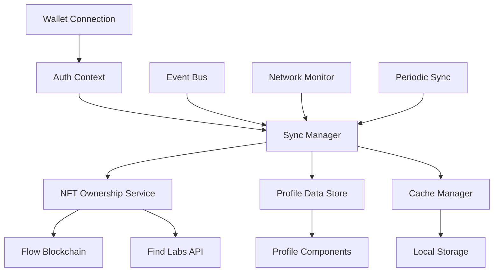

# Design Document

## Overview

The wallet-profile synchronization feature addresses critical synchronization issues between wallet connection state and profile data in ShotCaller. The current implementation has gaps where wallet connection doesn't immediately reflect in profile data, leading to inconsistent user experiences. This design implements a robust, real-time synchronization system that ensures wallet state, NFT collection data, and profile information remain consistent across the application.

## Architecture

### High-Level Architecture



### Core Components

1. **Wallet-Profile Sync Manager**: Central orchestrator for synchronization operations
2. **Enhanced Auth Context**: Extended authentication context with sync capabilities
3. **Profile Data Store**: Centralized profile state management
4. **Sync Event Bus**: Event-driven synchronization system
5. **Network Resilience Layer**: Handles connectivity issues and retries
6. **Cache Synchronization**: Intelligent caching with invalidation strategies

## Components and Interfaces

### 1. Wallet-Profile Sync Manager

```typescript
interface WalletProfileSyncManager {
  // Core sync operations
  syncWalletToProfile(address: string, force?: boolean): Promise<SyncResult>;
  syncNFTCollection(address: string): Promise<NFTSyncResult>;
  syncProfileStats(address: string): Promise<ProfileSyncResult>;
  
  // Event handling
  onWalletConnect(address: string, services: any[]): Promise<void>;
  onWalletDisconnect(): Promise<void>;
  onNFTCollectionChange(address: string): Promise<void>;
  
  // Status and monitoring
  getSyncStatus(): SyncStatus;
  getLastSyncTime(): Date | null;
  isSync InProgress(): boolean;
  
  // Configuration
  setSyncInterval(interval: number): void;
  enableAutoSync(enabled: boolean): void;
  setRetryPolicy(policy: RetryPolicy): void;
}

interface SyncResult {
  success: boolean;
  timestamp: Date;
  operations: SyncOperation[];
  errors?: SyncError[];
  duration: number;
}

interface SyncStatus {
  isActive: boolean;
  lastSync: Date | null;
  nextSync: Date | null;
  failureCount: number;
  currentOperation?: string;
}
```

### 2. Enhanced Auth Context

```typescript
interface EnhancedAuthContext extends AuthContextType {
  // Existing properties
  user: User;
  isAuthenticated: boolean;
  
  // New sync-related properties
  syncStatus: SyncStatus;
  profileData: ProfileData;
  nftCollection: NFTCollection;
  
  // New sync methods
  forceSyncProfile(): Promise<void>;
  refreshNFTCollection(): Promise<void>;
  getSyncHistory(): SyncEvent[];
  
  // Event subscriptions
  onSyncStatusChange(callback: (status: SyncStatus) => void): () => void;
  onProfileDataChange(callback: (data: ProfileData) => void): () => void;
}

interface ProfileData {
  address: string;
  username: string;
  walletType: WalletType;
  collections: string[];
  stats: ProfileStats;
  achievements: Achievement[];
  lastUpdated: Date;
}
```

### 3. Sync Event Bus

```typescript
interface SyncEventBus {
  // Event emission
  emit(event: SyncEvent): void;
  
  // Event subscription
  subscribe(eventType: SyncEventType, handler: SyncEventHandler): () => void;
  
  // Event types
  WALLET_CONNECTED: 'wallet_connected';
  WALLET_DISCONNECTED: 'wallet_disconnected';
  NFT_COLLECTION_UPDATED: 'nft_collection_updated';
  PROFILE_SYNC_STARTED: 'profile_sync_started';
  PROFILE_SYNC_COMPLETED: 'profile_sync_completed';
  SYNC_ERROR: 'sync_error';
}

interface SyncEvent {
  type: SyncEventType;
  timestamp: Date;
  data: any;
  source: string;
}
```

### 4. Network Resilience Layer

```typescript
interface NetworkResilienceManager {
  // Network monitoring
  isOnline(): boolean;
  getConnectionQuality(): ConnectionQuality;
  
  // Retry logic
  executeWithRetry<T>(
    operation: () => Promise<T>,
    policy: RetryPolicy
  ): Promise<T>;
  
  // Offline handling
  queueOfflineOperation(operation: OfflineOperation): void;
  processOfflineQueue(): Promise<void>;
  
  // Fallback strategies
  getFallbackData(key: string): any;
  setCachedFallback(key: string, data: any): void;
}

interface RetryPolicy {
  maxAttempts: number;
  baseDelay: number;
  maxDelay: number;
  backoffMultiplier: number;
  retryCondition: (error: Error) => boolean;
}
```

## Data Models

### Sync Operation Models

```typescript
interface SyncOperation {
  id: string;
  type: SyncOperationType;
  status: OperationStatus;
  startTime: Date;
  endTime?: Date;
  duration?: number;
  retryCount: number;
  error?: SyncError;
  metadata: Record<string, any>;
}

enum SyncOperationType {
  WALLET_VERIFICATION = 'wallet_verification',
  NFT_COLLECTION_FETCH = 'nft_collection_fetch',
  PROFILE_DATA_UPDATE = 'profile_data_update',
  CACHE_INVALIDATION = 'cache_invalidation',
  ELIGIBILITY_CHECK = 'eligibility_check'
}

enum OperationStatus {
  PENDING = 'pending',
  IN_PROGRESS = 'in_progress',
  COMPLETED = 'completed',
  FAILED = 'failed',
  RETRYING = 'retrying'
}
```

### Profile Synchronization Models

```typescript
interface ProfileSyncData {
  address: string;
  walletInfo: WalletInfo;
  nftCollection: NFTCollection;
  gameplayEligibility: EligibilityStatus;
  profileStats: ProfileStats;
  syncMetadata: SyncMetadata;
}

interface SyncMetadata {
  lastFullSync: Date;
  lastNFTSync: Date;
  lastStatsSync: Date;
  syncVersion: string;
  dataSource: DataSource;
  cacheStatus: CacheStatus;
}

interface EligibilityStatus {
  isEligible: boolean;
  reason?: string;
  collections: string[];
  eligibleMoments: number;
  lastChecked: Date;
}
```

## Error Handling

### Error Classification and Recovery

```typescript
enum SyncErrorType {
  NETWORK_ERROR = 'network_error',
  AUTHENTICATION_ERROR = 'authentication_error',
  API_ERROR = 'api_error',
  VALIDATION_ERROR = 'validation_error',
  CACHE_ERROR = 'cache_error',
  TIMEOUT_ERROR = 'timeout_error'
}

interface SyncError {
  type: SyncErrorType;
  message: string;
  code?: string;
  operation: SyncOperationType;
  timestamp: Date;
  retryable: boolean;
  context: Record<string, any>;
}

interface ErrorRecoveryStrategy {
  canRecover(error: SyncError): boolean;
  recover(error: SyncError): Promise<RecoveryResult>;
  getFallbackAction(error: SyncError): FallbackAction;
}
```

### Graceful Degradation

1. **Network Failures**: Use cached data with staleness indicators
2. **API Timeouts**: Implement progressive timeout increases
3. **Authentication Issues**: Prompt for re-authentication with context preservation
4. **Data Corruption**: Fallback to last known good state with user notification

## Testing Strategy

### Unit Testing

```typescript
// Sync Manager Tests
describe('WalletProfileSyncManager', () => {
  test('should sync wallet connection to profile immediately');
  test('should handle concurrent sync operations gracefully');
  test('should retry failed operations with exponential backoff');
  test('should emit appropriate events during sync lifecycle');
});

// Auth Context Tests
describe('EnhancedAuthContext', () => {
  test('should maintain sync status consistency');
  test('should update profile data when wallet changes');
  test('should handle wallet disconnection cleanup');
});

// Network Resilience Tests
describe('NetworkResilienceManager', () => {
  test('should detect network connectivity changes');
  test('should queue operations when offline');
  test('should process offline queue when connectivity returns');
});
```

### Integration Testing

```typescript
// End-to-End Sync Flow Tests
describe('Wallet-Profile Sync Integration', () => {
  test('complete wallet connection to profile sync flow');
  test('NFT collection changes reflected in profile');
  test('network interruption and recovery scenarios');
  test('concurrent user sessions sync behavior');
});

// Performance Tests
describe('Sync Performance', () => {
  test('sync operations complete within acceptable timeframes');
  test('memory usage remains stable during extended sync operations');
  test('cache invalidation doesn't cause performance degradation');
});
```

### User Experience Testing

1. **Sync Feedback**: Visual indicators during sync operations
2. **Error Communication**: Clear, actionable error messages
3. **Loading States**: Appropriate loading indicators without UI blocking
4. **Offline Behavior**: Graceful handling of offline scenarios

## Implementation Phases

### Phase 1: Core Sync Infrastructure
- Implement WalletProfileSyncManager
- Enhance AuthContext with sync capabilities
- Create SyncEventBus
- Basic error handling and retry logic

### Phase 2: Network Resilience
- Implement NetworkResilienceManager
- Add offline operation queuing
- Implement progressive retry strategies
- Add connection quality monitoring

### Phase 3: Advanced Features
- Real-time sync event notifications
- Predictive caching strategies
- Performance optimization
- Advanced error recovery

### Phase 4: Monitoring and Analytics
- Sync operation metrics
- Error tracking and alerting
- Performance monitoring
- User experience analytics

## Security Considerations

### Data Protection
- Encrypt sensitive sync data in local storage
- Implement secure session management
- Validate all sync operations against user permissions
- Audit trail for all sync activities

### Privacy Preservation
- Minimize data collection during sync operations
- Implement data retention policies for sync logs
- Ensure GDPR compliance for user data handling
- Secure transmission of sync data

## Performance Optimization

### Caching Strategy
- Implement intelligent cache invalidation
- Use cache warming for frequently accessed data
- Implement cache compression for large datasets
- Monitor cache hit rates and optimize accordingly

### Sync Optimization
- Batch multiple sync operations when possible
- Implement incremental sync for large datasets
- Use delta synchronization to minimize data transfer
- Optimize API calls with request deduplication

## Monitoring and Observability

### Metrics Collection
- Sync operation success/failure rates
- Average sync duration by operation type
- Network connectivity impact on sync performance
- User engagement with sync features

### Alerting
- Failed sync operations exceeding threshold
- Unusual sync patterns indicating issues
- Performance degradation alerts
- Critical error notifications

### Logging
- Structured logging for all sync operations
- User privacy-compliant error logging
- Performance metrics logging
- Audit trail for security-sensitive operations