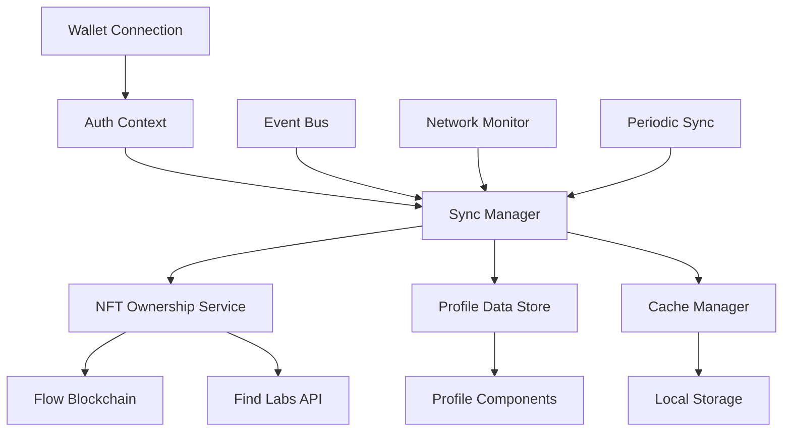

# Wallet-Profile Sync Developer Guide

## Overview

This guide provides comprehensive documentation for developers working with the ShotCaller wallet-profile synchronization system. It covers architecture, APIs, implementation patterns, and best practices.

## Architecture Overview

### System Components



### Core Interfaces

#### WalletProfileSyncManager

The central orchestrator for all synchronization operations.

```typescript
interface WalletProfileSyncManager {
  // Core sync operations
  syncWalletToProfile(address: string, force?: boolean): Promise<SyncResult>;
  syncNFTCollection(address: string): Promise<NFTSyncResult>;
  syncProfileStats(address: string): Promise<ProfileSyncResult>;
  
  // Event handling
  onWalletConnect(address: string, services: any[]): Promise<void>;
  onWalletDisconnect(): Promise<void>;
  onNFTCollectionChange(address: string): Promise<void>;
  
  // Status and monitoring
  getSyncStatus(): SyncStatus;
  getLastSyncTime(): Date | null;
  isSyncInProgress(): boolean;
  
  // Configuration
  setSyncInterval(interval: number): void;
  enableAutoSync(enabled: boolean): void;
  setRetryPolicy(policy: RetryPolicy): void;
}
```

#### Enhanced Auth Context

Extended authentication context with sync capabilities.

```typescript
interface EnhancedAuthContext extends AuthContextType {
  // Existing properties
  user: User;
  isAuthenticated: boolean;
  
  // New sync-related properties
  syncStatus: SyncStatus;
  profileData: ProfileData;
  nftCollection: NFTCollection;
  
  // New sync methods
  forceSyncProfile(): Promise<void>;
  refreshNFTCollection(): Promise<void>;
  getSyncHistory(): SyncEvent[];
  
  // Event subscriptions
  onSyncStatusChange(callback: (status: SyncStatus) => void): () => void;
  onProfileDataChange(callback: (data: ProfileData) => void): () => void;
}
```

## Data Models

### Sync Operation Models

```typescript
interface SyncOperation {
  id: string;
  type: SyncOperationType;
  status: OperationStatus;
  startTime: Date;
  endTime?: Date;
  duration?: number;
  retryCount: number;
  error?: SyncError;
  metadata: Record<string, any>;
}

enum SyncOperationType {
  WALLET_VERIFICATION = 'wallet_verification',
  NFT_COLLECTION_FETCH = 'nft_collection_fetch',
  PROFILE_DATA_UPDATE = 'profile_data_update',
  CACHE_INVALIDATION = 'cache_invalidation',
  ELIGIBILITY_CHECK = 'eligibility_check'
}

enum OperationStatus {
  PENDING = 'pending',
  IN_PROGRESS = 'in_progress',
  COMPLETED = 'completed',
  FAILED = 'failed',
  RETRYING = 'retrying'
}
```

### Profile Synchronization Models

```typescript
interface ProfileSyncData {
  address: string;
  walletInfo: WalletInfo;
  nftCollection: NFTCollection;
  gameplayEligibility: EligibilityStatus;
  profileStats: ProfileStats;
  syncMetadata: SyncMetadata;
}

interface SyncMetadata {
  lastFullSync: Date;
  lastNFTSync: Date;
  lastStatsSync: Date;
  syncVersion: string;
  dataSource: DataSource;
  cacheStatus: CacheStatus;
}

interface EligibilityStatus {
  isEligible: boolean;
  reason?: string;
  collections: string[];
  eligibleMoments: number;
  lastChecked: Date;
}
```

### Error Models

```typescript
enum SyncErrorType {
  NETWORK_ERROR = 'network_error',
  AUTHENTICATION_ERROR = 'authentication_error',
  API_ERROR = 'api_error',
  VALIDATION_ERROR = 'validation_error',
  CACHE_ERROR = 'cache_error',
  TIMEOUT_ERROR = 'timeout_error'
}

interface SyncError {
  type: SyncErrorType;
  message: string;
  code?: string;
  operation: SyncOperationType;
  timestamp: Date;
  retryable: boolean;
  context: Record<string, any>;
}
```

## API Reference

### Sync Manager API

#### Core Methods

```typescript
// Initialize sync manager
const syncManager = new WalletProfileSyncManager({
  retryPolicy: {
    maxAttempts: 3,
    baseDelay: 1000,
    maxDelay: 10000,
    backoffMultiplier: 2
  },
  syncInterval: 300000, // 5 minutes
  autoSync: true
});

// Sync wallet to profile
const result = await syncManager.syncWalletToProfile(walletAddress, true);
if (result.success) {
  console.log('Sync completed successfully');
} else {
  console.error('Sync failed:', result.errors);
}

// Get current sync status
const status = syncManager.getSyncStatus();
console.log('Sync status:', status);

// Subscribe to sync events
const unsubscribe = syncManager.onSyncStatusChange((status) => {
  console.log('Sync status changed:', status);
});
```

#### Event Handling

```typescript
// Handle wallet connection
await syncManager.onWalletConnect(walletAddress, walletServices);

// Handle wallet disconnection
await syncManager.onWalletDisconnect();

// Handle NFT collection changes
await syncManager.onNFTCollectionChange(walletAddress);
```

### Event Bus API

```typescript
interface SyncEventBus {
  // Event emission
  emit(event: SyncEvent): void;
  
  // Event subscription
  subscribe(eventType: SyncEventType, handler: SyncEventHandler): () => void;
  
  // Event types
  WALLET_CONNECTED: 'wallet_connected';
  WALLET_DISCONNECTED: 'wallet_disconnected';
  NFT_COLLECTION_UPDATED: 'nft_collection_updated';
  PROFILE_SYNC_STARTED: 'profile_sync_started';
  PROFILE_SYNC_COMPLETED: 'profile_sync_completed';
  SYNC_ERROR: 'sync_error';
}

// Usage example
const eventBus = new SyncEventBus();

// Subscribe to events
const unsubscribe = eventBus.subscribe('PROFILE_SYNC_COMPLETED', (event) => {
  console.log('Profile sync completed:', event.data);
});

// Emit events
eventBus.emit({
  type: 'PROFILE_SYNC_STARTED',
  timestamp: new Date(),
  data: { address: walletAddress },
  source: 'sync-manager'
});
```

### Network Resilience API

```typescript
interface NetworkResilienceManager {
  // Network monitoring
  isOnline(): boolean;
  getConnectionQuality(): ConnectionQuality;
  
  // Retry logic
  executeWithRetry<T>(
    operation: () => Promise<T>,
    policy: RetryPolicy
  ): Promise<T>;
  
  // Offline handling
  queueOfflineOperation(operation: OfflineOperation): void;
  processOfflineQueue(): Promise<void>;
}

// Usage example
const networkManager = new NetworkResilienceManager();

// Execute operation with retry
const result = await networkManager.executeWithRetry(
  () => fetchNFTCollection(address),
  {
    maxAttempts: 3,
    baseDelay: 1000,
    maxDelay: 5000,
    backoffMultiplier: 2,
    retryCondition: (error) => error.type === 'NETWORK_ERROR'
  }
);

// Queue offline operation
if (!networkManager.isOnline()) {
  networkManager.queueOfflineOperation({
    type: 'NFT_SYNC',
    data: { address },
    timestamp: new Date()
  });
}
```

## Implementation Patterns

### React Hook Integration

```typescript
// Custom hook for sync status
export function useSyncStatus() {
  const [status, setStatus] = useState<SyncStatus>();
  const { syncManager } = useAuth();

  useEffect(() => {
    if (!syncManager) return;

    const unsubscribe = syncManager.onSyncStatusChange(setStatus);
    setStatus(syncManager.getSyncStatus());

    return unsubscribe;
  }, [syncManager]);

  return status;
}

// Custom hook for manual sync
export function useManualSync() {
  const { syncManager } = useAuth();
  const [isLoading, setIsLoading] = useState(false);

  const forcSync = useCallback(async () => {
    if (!syncManager) return;

    setIsLoading(true);
    try {
      await syncManager.forceSyncProfile();
    } finally {
      setIsLoading(false);
    }
  }, [syncManager]);

  return { forceSync, isLoading };
}
```

### Component Integration

```typescript
// Sync status component
export function SyncStatusIndicator() {
  const syncStatus = useSyncStatus();
  const { forceSync, isLoading } = useManualSync();

  if (!syncStatus) return null;

  return (
    <div className="flex items-center gap-2">
      <SyncStatusDot status={syncStatus.status} />
      {syncStatus.status === 'error' && (
        <Button size="sm" onClick={forceSync} disabled={isLoading}>
          Retry
        </Button>
      )}
    </div>
  );
}

// Profile sync integration
export function ProfilePage() {
  const { profileData, syncStatus } = useAuth();
  const { forceSync } = useManualSync();

  return (
    <div>
      <div className="flex justify-between items-center">
        <h1>Profile</h1>
        <Button onClick={forceSync}>
          <RefreshCw className="h-4 w-4 mr-2" />
          Refresh
        </Button>
      </div>
      
      {syncStatus?.status === 'syncing' && (
        <div className="mb-4">
          <SyncLoadingIndicator />
        </div>
      )}
      
      <ProfileContent data={profileData} />
    </div>
  );
}
```

## Configuration

### Environment Variables

```bash
# Sync configuration
NEXT_PUBLIC_SYNC_INTERVAL=300000          # 5 minutes
NEXT_PUBLIC_AUTO_SYNC_ENABLED=true
NEXT_PUBLIC_SYNC_RETRY_ATTEMPTS=3
NEXT_PUBLIC_SYNC_TIMEOUT=30000            # 30 seconds

# API endpoints
NEXT_PUBLIC_FLOW_API_URL=https://rest-mainnet.onflow.org
NEXT_PUBLIC_FINDLABS_API_URL=https://api.find.xyz

# Cache configuration
NEXT_PUBLIC_CACHE_TTL=300000              # 5 minutes
NEXT_PUBLIC_CACHE_MAX_SIZE=50             # MB
```

### Sync Manager Configuration

```typescript
interface SyncManagerConfig {
  retryPolicy: RetryPolicy;
  syncInterval: number;
  autoSync: boolean;
  cacheConfig: CacheConfig;
  networkConfig: NetworkConfig;
  loggingConfig: LoggingConfig;
}

const config: SyncManagerConfig = {
  retryPolicy: {
    maxAttempts: 3,
    baseDelay: 1000,
    maxDelay: 10000,
    backoffMultiplier: 2,
    retryCondition: (error) => error.retryable
  },
  syncInterval: 300000, // 5 minutes
  autoSync: true,
  cacheConfig: {
    ttl: 300000,
    maxSize: 50 * 1024 * 1024, // 50MB
    compression: true
  },
  networkConfig: {
    timeout: 30000,
    maxConcurrentRequests: 5
  },
  loggingConfig: {
    level: 'info',
    enablePerformanceMetrics: true
  }
};
```

## Testing

### Unit Testing

```typescript
// Sync manager tests
describe('WalletProfileSyncManager', () => {
  let syncManager: WalletProfileSyncManager;
  let mockNFTService: jest.Mocked<NFTOwnershipService>;

  beforeEach(() => {
    mockNFTService = createMockNFTService();
    syncManager = new WalletProfileSyncManager({
      nftService: mockNFTService,
      retryPolicy: { maxAttempts: 1, baseDelay: 0 }
    });
  });

  test('should sync wallet to profile successfully', async () => {
    const mockNFTs = [{ id: '1', name: 'Test NFT' }];
    mockNFTService.fetchCollection.mockResolvedValue(mockNFTs);

    const result = await syncManager.syncWalletToProfile('0x123');

    expect(result.success).toBe(true);
    expect(mockNFTService.fetchCollection).toHaveBeenCalledWith('0x123');
  });

  test('should handle sync errors gracefully', async () => {
    mockNFTService.fetchCollection.mockRejectedValue(new Error('Network error'));

    const result = await syncManager.syncWalletToProfile('0x123');

    expect(result.success).toBe(false);
    expect(result.errors).toHaveLength(1);
  });
});
```

### Integration Testing

```typescript
// End-to-end sync flow tests
describe('Sync Integration', () => {
  test('complete wallet connection to profile sync flow', async () => {
    // Mock wallet connection
    const mockWallet = createMockWallet();
    await mockWallet.connect();

    // Trigger sync
    const syncManager = new WalletProfileSyncManager();
    await syncManager.onWalletConnect(mockWallet.address, []);

    // Verify profile update
    const profileData = await getProfileData(mockWallet.address);
    expect(profileData.address).toBe(mockWallet.address);
    expect(profileData.nftCollection).toBeDefined();
  });
});
```

### Performance Testing

```typescript
// Performance benchmarks
describe('Sync Performance', () => {
  test('sync operations complete within acceptable timeframes', async () => {
    const startTime = Date.now();
    
    await syncManager.syncWalletToProfile(testAddress);
    
    const duration = Date.now() - startTime;
    expect(duration).toBeLessThan(5000); // 5 seconds
  });

  test('memory usage remains stable during extended sync operations', async () => {
    const initialMemory = process.memoryUsage().heapUsed;
    
    // Perform multiple sync operations
    for (let i = 0; i < 100; i++) {
      await syncManager.syncNFTCollection(testAddress);
    }
    
    const finalMemory = process.memoryUsage().heapUsed;
    const memoryIncrease = finalMemory - initialMemory;
    
    expect(memoryIncrease).toBeLessThan(50 * 1024 * 1024); // 50MB
  });
});
```

## Error Handling

### Error Classification

```typescript
class SyncErrorClassifier {
  static classify(error: Error): SyncErrorType {
    if (error.message.includes('network')) {
      return SyncErrorType.NETWORK_ERROR;
    }
    if (error.message.includes('timeout')) {
      return SyncErrorType.TIMEOUT_ERROR;
    }
    if (error.message.includes('auth')) {
      return SyncErrorType.AUTHENTICATION_ERROR;
    }
    return SyncErrorType.API_ERROR;
  }

  static isRetryable(error: SyncError): boolean {
    return [
      SyncErrorType.NETWORK_ERROR,
      SyncErrorType.TIMEOUT_ERROR,
      SyncErrorType.API_ERROR
    ].includes(error.type);
  }
}
```

### Error Recovery Strategies

```typescript
interface ErrorRecoveryStrategy {
  canRecover(error: SyncError): boolean;
  recover(error: SyncError): Promise<RecoveryResult>;
  getFallbackAction(error: SyncError): FallbackAction;
}

class NetworkErrorRecovery implements ErrorRecoveryStrategy {
  canRecover(error: SyncError): boolean {
    return error.type === SyncErrorType.NETWORK_ERROR;
  }

  async recover(error: SyncError): Promise<RecoveryResult> {
    // Wait for network connectivity
    await this.waitForConnectivity();
    
    // Retry the failed operation
    return this.retryOperation(error.operation);
  }

  getFallbackAction(error: SyncError): FallbackAction {
    return {
      type: 'USE_CACHED_DATA',
      message: 'Using cached data while offline'
    };
  }
}
```

## Performance Optimization

### Caching Strategies

```typescript
interface CacheStrategy {
  shouldCache(data: any): boolean;
  getCacheKey(params: any): string;
  getTTL(data: any): number;
  shouldInvalidate(event: SyncEvent): boolean;
}

class NFTCollectionCacheStrategy implements CacheStrategy {
  shouldCache(data: NFTCollection): boolean {
    return data.items.length > 0;
  }

  getCacheKey(address: string): string {
    return `nft-collection:${address}`;
  }

  getTTL(data: NFTCollection): number {
    // Larger collections cached longer
    return Math.min(data.items.length * 1000, 300000);
  }

  shouldInvalidate(event: SyncEvent): boolean {
    return event.type === 'NFT_COLLECTION_UPDATED';
  }
}
```

### Batch Processing

```typescript
class BatchSyncProcessor {
  private queue: SyncOperation[] = [];
  private processing = false;

  async addOperation(operation: SyncOperation): Promise<void> {
    this.queue.push(operation);
    
    if (!this.processing) {
      await this.processBatch();
    }
  }

  private async processBatch(): Promise<void> {
    this.processing = true;
    
    try {
      // Group operations by type
      const grouped = this.groupOperations(this.queue);
      
      // Process each group concurrently
      await Promise.all(
        Object.entries(grouped).map(([type, operations]) =>
          this.processOperationGroup(type, operations)
        )
      );
    } finally {
      this.processing = false;
      this.queue = [];
    }
  }
}
```

## Monitoring and Observability

### Metrics Collection

```typescript
interface SyncMetrics {
  operationCount: number;
  successRate: number;
  averageDuration: number;
  errorRate: number;
  cacheHitRate: number;
}

class SyncMetricsCollector {
  private metrics: Map<string, SyncMetrics> = new Map();

  recordOperation(operation: SyncOperation): void {
    const key = operation.type;
    const current = this.metrics.get(key) || this.getDefaultMetrics();
    
    current.operationCount++;
    
    if (operation.status === OperationStatus.COMPLETED) {
      current.successRate = this.calculateSuccessRate(key);
      current.averageDuration = this.calculateAverageDuration(key);
    } else if (operation.status === OperationStatus.FAILED) {
      current.errorRate = this.calculateErrorRate(key);
    }
    
    this.metrics.set(key, current);
  }

  getMetrics(operationType?: string): SyncMetrics | Map<string, SyncMetrics> {
    if (operationType) {
      return this.metrics.get(operationType) || this.getDefaultMetrics();
    }
    return this.metrics;
  }
}
```

### Logging

```typescript
interface SyncLogger {
  info(message: string, context?: any): void;
  warn(message: string, context?: any): void;
  error(message: string, error?: Error, context?: any): void;
  debug(message: string, context?: any): void;
}

class StructuredSyncLogger implements SyncLogger {
  info(message: string, context?: any): void {
    console.log(JSON.stringify({
      level: 'info',
      message,
      context,
      timestamp: new Date().toISOString(),
      service: 'wallet-profile-sync'
    }));
  }

  error(message: string, error?: Error, context?: any): void {
    console.error(JSON.stringify({
      level: 'error',
      message,
      error: error?.message,
      stack: error?.stack,
      context,
      timestamp: new Date().toISOString(),
      service: 'wallet-profile-sync'
    }));
  }
}
```

## Security Considerations

### Data Encryption

```typescript
class SyncDataEncryption {
  private key: CryptoKey;

  async encryptSyncData(data: any): Promise<string> {
    const jsonData = JSON.stringify(data);
    const encodedData = new TextEncoder().encode(jsonData);
    
    const encrypted = await crypto.subtle.encrypt(
      { name: 'AES-GCM', iv: crypto.getRandomValues(new Uint8Array(12)) },
      this.key,
      encodedData
    );
    
    return btoa(String.fromCharCode(...new Uint8Array(encrypted)));
  }

  async decryptSyncData(encryptedData: string): Promise<any> {
    const encrypted = new Uint8Array(
      atob(encryptedData).split('').map(char => char.charCodeAt(0))
    );
    
    const decrypted = await crypto.subtle.decrypt(
      { name: 'AES-GCM', iv: encrypted.slice(0, 12) },
      this.key,
      encrypted.slice(12)
    );
    
    const jsonData = new TextDecoder().decode(decrypted);
    return JSON.parse(jsonData);
  }
}
```

### Permission Validation

```typescript
class SyncPermissionValidator {
  validateSyncOperation(
    operation: SyncOperation,
    userContext: UserContext
  ): boolean {
    // Validate user has permission to sync this wallet
    if (!this.canAccessWallet(operation.walletAddress, userContext)) {
      return false;
    }

    // Validate operation type is allowed
    if (!this.isOperationAllowed(operation.type, userContext)) {
      return false;
    }

    return true;
  }

  private canAccessWallet(address: string, context: UserContext): boolean {
    return context.connectedWallets.includes(address);
  }

  private isOperationAllowed(type: SyncOperationType, context: UserContext): boolean {
    const allowedOperations = context.permissions.syncOperations;
    return allowedOperations.includes(type);
  }
}
```

## Best Practices

### Implementation Guidelines

1. **Always handle errors gracefully**
   ```typescript
   try {
     await syncManager.syncWalletToProfile(address);
   } catch (error) {
     logger.error('Sync failed', error, { address });
     // Show user-friendly error message
     showErrorToast('Failed to sync profile. Please try again.');
   }
   ```

2. **Use proper loading states**
   ```typescript
   const [isLoading, setIsLoading] = useState(false);
   
   const handleSync = async () => {
     setIsLoading(true);
     try {
       await syncManager.forceSyncProfile();
     } finally {
       setIsLoading(false);
     }
   };
   ```

3. **Implement proper cleanup**
   ```typescript
   useEffect(() => {
     const unsubscribe = syncManager.onSyncStatusChange(handleStatusChange);
     return unsubscribe; // Cleanup subscription
   }, [syncManager]);
   ```

4. **Cache appropriately**
   ```typescript
   // Cache NFT data but not user-specific sync status
   const cacheKey = `nft-collection:${address}`;
   const cachedData = cache.get(cacheKey);
   
   if (cachedData && !isStale(cachedData)) {
     return cachedData;
   }
   ```

### Performance Guidelines

1. **Batch operations when possible**
2. **Use appropriate cache TTL values**
3. **Implement request deduplication**
4. **Monitor memory usage**
5. **Use lazy loading for large datasets**

### Security Guidelines

1. **Never store private keys**
2. **Encrypt sensitive data in local storage**
3. **Validate all sync operations**
4. **Implement proper session management**
5. **Use secure communication channels**

## Troubleshooting

### Common Issues

1. **Sync not triggering**
   - Check wallet connection status
   - Verify sync manager initialization
   - Check network connectivity

2. **Slow sync performance**
   - Monitor network conditions
   - Check cache hit rates
   - Analyze operation timing

3. **Memory leaks**
   - Verify event listener cleanup
   - Check cache size limits
   - Monitor component unmounting

### Debugging Tools

```typescript
// Enable debug mode
const syncManager = new WalletProfileSyncManager({
  debug: true,
  logLevel: 'debug'
});

// Access debug information
const debugInfo = syncManager.getDebugInfo();
console.log('Sync debug info:', debugInfo);

// Monitor sync events
syncManager.onDebugEvent((event) => {
  console.log('Debug event:', event);
});
```

## Migration Guide

### Upgrading from Previous Versions

1. **Update imports**
   ```typescript
   // Old
   import { SyncManager } from './sync-manager';
   
   // New
   import { WalletProfileSyncManager } from './wallet-profile-sync-manager';
   ```

2. **Update configuration**
   ```typescript
   // Old
   const syncManager = new SyncManager(config);
   
   // New
   const syncManager = new WalletProfileSyncManager({
     ...config,
     retryPolicy: { maxAttempts: 3 }
   });
   ```

3. **Update event handling**
   ```typescript
   // Old
   syncManager.on('sync-complete', handler);
   
   // New
   syncManager.onSyncStatusChange(handler);
   ```

This developer guide provides comprehensive documentation for implementing and maintaining the wallet-profile synchronization system in ShotCaller. For additional support, refer to the user guide or contact the development team.